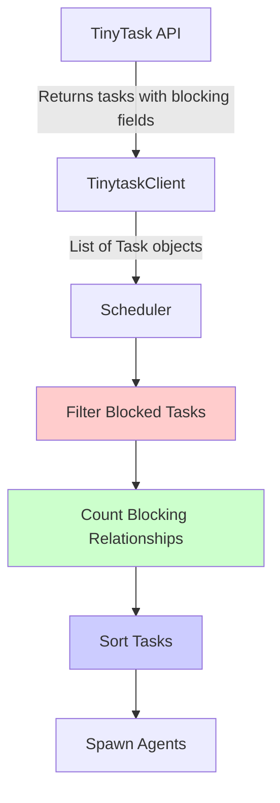

# Product Story: TinyScheduler Task Blocking Integration

**Epic**: TinyTask Blocking Feature Integration  
**Story ID**: TS-BLOCK-001  
**Priority**: High  
**Estimated Effort**: 8-10 hours  
**Sprint**: Current  

---

## Story Overview

**As a** TinyScheduler operator  
**I want** the scheduler to respect task blocking relationships from TinyTask  
**So that** blocked tasks are not spawned prematurely and blocker tasks are prioritized, improving overall task execution efficiency

---

## Acceptance Criteria

### Must Have

- [ ] **AC-1**: Blocked tasks (`is_currently_blocked=true`) are never spawned to agents
- [ ] **AC-2**: Tasks that block other tasks are spawned before non-blocker tasks
- [ ] **AC-3**: Within blocker tasks, those blocking more tasks are spawned first
- [ ] **AC-4**: Works in both queue-based mode and legacy mode
- [ ] **AC-5**: Backward compatible with TinyTask instances without blocking feature
- [ ] **AC-6**: Blocked task count appears in reconciliation logs
- [ ] **AC-7**: All existing tests continue to pass
- [ ] **AC-8**: New unit tests for filtering and sorting pass
- [ ] **AC-9**: New integration tests pass
- [ ] **AC-10**: No significant performance degradation (<5% increase in reconciliation time)

### Should Have

- [ ] **AC-11**: Blocker task prioritization is logged with counts
- [ ] **AC-12**: Statistics include `tasks_blocked` count
- [ ] **AC-13**: Documentation updated with blocking behavior

### Nice to Have

- [ ] **AC-14**: Dry-run mode shows which tasks would be skipped as blocked
- [ ] **AC-15**: Configuration option to disable blocking behavior for rollback

---

## Background

TinyTask has implemented a task blocking feature where:
- Tasks can have a `blocked_by_task_id` field referencing another task
- TinyTask computes `is_currently_blocked` based on whether the blocker is complete
- Tasks have a `priority` field for sorting

**Current Problem**:
- TinyScheduler spawns tasks without checking blocking status
- Blocked tasks waste agent slots (agents wait for dependencies)
- No prioritization of blocker tasks

**Desired Outcome**:
- Blocked tasks are filtered out before spawning
- Blocker tasks are prioritized to unblock dependencies faster
- Efficient use of agent resources

**Reference**: [TinyScheduler Blocking Integration Plan](../technical/tinyscheduler-blocking-integration.md)

---

## Technical Design Summary

### Architecture Overview



### Changes Required

1. **Task Data Model** ([`src/scheduler/tinytask_client.py`](../../src/scheduler/tinytask_client.py))
   - Add `priority`, `blocked_by_task_id`, `is_currently_blocked` fields
   
2. **Scheduler Helpers** ([`src/scheduler/scheduler.py`](../../src/scheduler/scheduler.py))
   - Add `_filter_blocked_tasks()` method
   - Add `_count_blocking_relationships()` method
   - Add `_sort_tasks_for_spawning()` method
   
3. **Integration Points** ([`src/scheduler/scheduler.py`](../../src/scheduler/scheduler.py))
   - `_process_unassigned_tasks()` - Filter and sort unassigned tasks
   - `_process_assigned_tasks()` - Filter assigned idle tasks
   - Legacy mode - Filter and sort in legacy path

---

## Implementation Tasks

### Task 1: Update Task Data Model
**File**: [`src/scheduler/tinytask_client.py`](../../src/scheduler/tinytask_client.py)  
**Estimated Time**: 1 hour  
**Dependencies**: None

#### Subtasks
1. Add new fields to `Task` dataclass (lines 17-50):
   ```python
   priority: int = 0
   blocked_by_task_id: Optional[int] = None
   is_currently_blocked: bool = False
   ```

2. Update `Task.from_dict()` method to parse new fields with defaults:
   ```python
   priority=data.get('priority', 0),
   blocked_by_task_id=data.get('blocked_by_task_id'),
   is_currently_blocked=data.get('is_currently_blocked', False),
   ```

3. Add docstring noting backward compatibility

#### Verification
- [ ] Task can be created with all new fields
- [ ] Task can be created without new fields (defaults applied)
- [ ] `from_dict()` parses complete TinyTask response
- [ ] `from_dict()` handles missing fields gracefully

---

### Task 2: Add Filtering Helper Method
**File**: [`src/scheduler/scheduler.py`](../../src/scheduler/scheduler.py)  
**Estimated Time**: 45 minutes  
**Dependencies**: Task 1

#### Implementation
Add method after existing helpers (around line 230):

```python
def _filter_blocked_tasks(self, tasks: List[Task]) -> Tuple[List[Task], int]:
    """
    Filter out blocked tasks.
    
    Tasks are considered blocked if is_currently_blocked=True.
    This is computed by TinyTask based on the blocking task's status.
    
    Args:
        tasks: List of tasks to filter
        
    Returns:
        Tuple of (unblocked_tasks, blocked_count)
        
    Example:
        tasks = [
            Task(task_id="1", is_currently_blocked=False),
            Task(task_id="2", is_currently_blocked=True),
            Task(task_id="3", is_currently_blocked=False),
        ]
        unblocked, count = self._filter_blocked_tasks(tasks)
        # unblocked = [Task("1"), Task("3")]
        # count = 1
    """
    unblocked = []
    blocked_count = 0
    
    for task in tasks:
        if task.is_currently_blocked:
            self.logger.debug(
                f"Task {task.task_id} is blocked by task {task.blocked_by_task_id}, skipping"
            )
            blocked_count += 1
        else:
            unblocked.append(task)
    
    if blocked_count > 0:
        self.logger.info(f"Filtered out {blocked_count} blocked task(s)")
    
    return unblocked, blocked_count
```

#### Verification
- [ ] Returns empty list and count=0 for empty input
- [ ] Returns all tasks when none blocked
- [ ] Filters blocked tasks correctly
- [ ] Returns correct blocked count
- [ ] Logs appropriate messages

---

### Task 3: Add Blocker Counting Helper Method
**File**: [`src/scheduler/scheduler.py`](../../src/scheduler/scheduler.py)  
**Estimated Time**: 45 minutes  
**Dependencies**: Task 1

#### Implementation
Add method after `_filter_blocked_tasks()`:

```python
def _count_blocking_relationships(self, tasks: List[Task]) -> Dict[str, int]:
    """
    Count how many tasks each task is blocking.
    
    This helps prioritize tasks that will unblock the most other tasks
    when completed. Only counts relationships within the provided task list.
    
    Args:
        tasks: List of all tasks (blocked and unblocked)
        
    Returns:
        Dict mapping task_id -> count of tasks it blocks
        
    Example:
        tasks = [
            Task(task_id="1", blocked_by_task_id=None),
            Task(task_id="2", blocked_by_task_id=1),
            Task(task_id="3", blocked_by_task_id=1),
            Task(task_id="4", blocked_by_task_id=2),
        ]
        counts = self._count_blocking_relationships(tasks)
        # counts = {"1": 2, "2": 1}
    """
    blocker_counts = {}
    
    # Build set of task IDs we have
    task_ids = {task.task_id for task in tasks}
    
    # Count blocking relationships
    for task in tasks:
        if task.blocked_by_task_id:
            blocker_id = str(task.blocked_by_task_id)
            if blocker_id in task_ids:
                blocker_counts[blocker_id] = blocker_counts.get(blocker_id, 0) + 1
    
    return blocker_counts
```

#### Verification
- [ ] Returns empty dict for no blocking relationships
- [ ] Counts single blocker correctly
- [ ] Counts multiple blockers correctly
- [ ] Handles blockers not in task list
- [ ] Handles string/int task_id conversion

---

### Task 4: Add Sorting Helper Method
**File**: [`src/scheduler/scheduler.py`](../../src/scheduler/scheduler.py)  
**Estimated Time**: 1 hour  
**Dependencies**: Task 3

#### Implementation
Add method after `_count_blocking_relationships()`:

```python
def _sort_tasks_for_spawning(
    self, 
    tasks: List[Task], 
    blocker_counts: Dict[str, int]
) -> List[Task]:
    """
    Sort tasks for optimal spawning order.
    
    Priority order (descending importance):
    1. Tasks blocking other tasks (most blockers first)
    2. Task priority (higher priority first)
    3. Creation time (older tasks first - FIFO)
    
    This ensures blocker tasks complete first, unblocking dependencies,
    while maintaining priority and fairness within each group.
    
    Args:
        tasks: List of tasks to sort
        blocker_counts: Dict of task_id -> count of tasks it blocks
        
    Returns:
        Sorted list of tasks
        
    Example:
        tasks = [
            Task(task_id="1", priority=5, created_at="2026-01-25T10:00:00"),
            Task(task_id="2", priority=10, created_at="2026-01-25T11:00:00"),
            Task(task_id="3", priority=5, created_at="2026-01-25T09:00:00"),
        ]
        blocker_counts = {"1": 2}  # Task 1 blocks 2 others
        sorted_tasks = self._sort_tasks_for_spawning(tasks, blocker_counts)
        # Order: Task 1 (blocker), Task 2 (high priority), Task 3 (older)
    """
    def sort_key(task: Task):
        # Blocker count (descending - negate for sorting)
        blocker_count = blocker_counts.get(task.task_id, 0)
        
        # Priority (descending - negate for sorting)
        priority = task.priority
        
        # Creation time (ascending - older first)
        # Handle missing created_at gracefully
        created_at = task.created_at or "9999-99-99"
        
        return (-blocker_count, -priority, created_at)
    
    sorted_tasks = sorted(tasks, key=sort_key)
    
    # Log if we have blocker tasks
    blocker_tasks = [t for t in sorted_tasks if blocker_counts.get(t.task_id, 0) > 0]
    if blocker_tasks:
        total_blocked = sum(blocker_counts.values())
        self.logger.info(
            f"Prioritizing {len(blocker_tasks)} blocker task(s) "
            f"(blocking {total_blocked} tasks)"
        )
        # Log top 5 blocker tasks for visibility
        for task in blocker_tasks[:5]:
            count = blocker_counts[task.task_id]
            self.logger.debug(
                f"  Task {task.task_id} blocks {count} task(s) "
                f"(priority={task.priority})"
            )
    
    return sorted_tasks
```

#### Verification
- [ ] Sorts by blocker count correctly
- [ ] Sorts by priority correctly
- [ ] Sorts by creation time correctly
- [ ] Multi-level sort works correctly
- [ ] Handles missing created_at field
- [ ] Logs blocker prioritization

---

### Task 5: Integrate into Queue-Based Mode (Unassigned Tasks)
**File**: [`src/scheduler/scheduler.py`](../../src/scheduler/scheduler.py)  
**Line**: ~282 in `_process_unassigned_tasks()`  
**Estimated Time**: 1 hour  
**Dependencies**: Tasks 2, 3, 4

#### Implementation
After line `self.logger.info(f"Found {len(tasks)} unassigned tasks...")`:

```python
# Filter blocked tasks
tasks, blocked_count = self._filter_blocked_tasks(tasks)
stats['tasks_blocked'] = stats.get('tasks_blocked', 0) + blocked_count

if not tasks:
    self.logger.debug(f"No unblocked tasks available in queue '{queue_name}'")
    continue

# Count blocking relationships for sorting
blocker_counts = self._count_blocking_relationships(tasks)

# Sort for optimal spawning order
tasks = self._sort_tasks_for_spawning(tasks, blocker_counts)

# Continue with existing assignment logic
for task in tasks:
    # ... existing code ...
```

#### Verification
- [ ] Blocked tasks are not assigned to agents
- [ ] Blocker tasks are assigned first
- [ ] Stats tracking works correctly
- [ ] Existing queue mode tests pass
- [ ] New integration test passes

---

### Task 6: Integrate into Queue-Based Mode (Assigned Tasks)
**File**: [`src/scheduler/scheduler.py`](../../src/scheduler/scheduler.py)  
**Line**: ~354 in `_process_assigned_tasks()`  
**Estimated Time**: 30 minutes  
**Dependencies**: Task 2

#### Implementation
After line `self.logger.info(f"Found {len(idle_tasks)} idle tasks...")`:

```python
# Filter blocked tasks
idle_tasks, blocked_count = self._filter_blocked_tasks(idle_tasks)
stats['tasks_blocked'] = stats.get('tasks_blocked', 0) + blocked_count

# Continue with existing spawn logic
for task in idle_tasks:
    # ... existing code ...
```

#### Verification
- [ ] Blocked assigned tasks are not spawned
- [ ] Unblocked assigned tasks spawn correctly
- [ ] Stats tracking works correctly

---

### Task 7: Integrate into Legacy Mode
**File**: [`src/scheduler/scheduler.py`](../../src/scheduler/scheduler.py)  
**Line**: ~474 in `reconcile()` legacy mode section  
**Estimated Time**: 45 minutes  
**Dependencies**: Tasks 2, 3, 4

#### Implementation
After line `self.logger.info(f"Found {len(idle_tasks)} idle tasks...")`:

```python
# Filter blocked tasks
idle_tasks, blocked_count = self._filter_blocked_tasks(idle_tasks)
stats['tasks_blocked'] = stats.get('tasks_blocked', 0) + blocked_count

# Sort tasks (even in legacy mode, optimize within agent)
if idle_tasks:
    blocker_counts = self._count_blocking_relationships(idle_tasks)
    idle_tasks = self._sort_tasks_for_spawning(idle_tasks, blocker_counts)

for task in idle_tasks[:available]:
    # ... existing spawn logic ...
```

#### Verification
- [ ] Legacy mode filters blocked tasks
- [ ] Legacy mode sorts tasks optimally
- [ ] Backward compatibility maintained
- [ ] Existing legacy tests pass

---

### Task 8: Update Statistics Logging
**File**: [`src/scheduler/scheduler.py`](../../src/scheduler/scheduler.py)  
**Line**: ~501 in `reconcile()` summary section  
**Estimated Time**: 15 minutes  
**Dependencies**: Tasks 5, 6, 7

#### Implementation
Add after existing log statements:

```python
self.logger.info(f"Blocked tasks skipped: {stats.get('tasks_blocked', 0)}")
```

#### Verification
- [ ] Blocked task count appears in logs
- [ ] Stat is 0 when no blocked tasks
- [ ] Stat accumulates correctly across queues

---

### Task 9: Write Unit Tests
**File**: `tests/scheduler/test_blocking.py` (new file)  
**Estimated Time**: 2-3 hours  
**Dependencies**: Tasks 2, 3, 4

#### Test Cases

```python
"""Unit tests for task blocking functionality."""

import pytest
from datetime import datetime
from src.scheduler.tinytask_client import Task
from src.scheduler.scheduler import TinyScheduler


class TestTaskDataModel:
    """Test Task dataclass with blocking fields."""
    
    def test_task_with_all_blocking_fields(self):
        """Task can be created with all blocking fields."""
        task = Task(
            task_id="1",
            agent="test-agent",
            status="idle",
            priority=10,
            blocked_by_task_id=5,
            is_currently_blocked=True
        )
        assert task.priority == 10
        assert task.blocked_by_task_id == 5
        assert task.is_currently_blocked is True
    
    def test_task_without_blocking_fields(self):
        """Task uses defaults when blocking fields missing."""
        task = Task(
            task_id="1",
            agent="test-agent",
            status="idle"
        )
        assert task.priority == 0
        assert task.blocked_by_task_id is None
        assert task.is_currently_blocked is False
    
    def test_task_from_dict_complete(self):
        """from_dict parses all blocking fields."""
        data = {
            'id': 1,
            'assigned_to': 'agent1',
            'status': 'idle',
            'priority': 5,
            'blocked_by_task_id': 10,
            'is_currently_blocked': True
        }
        task = Task.from_dict(data)
        assert task.priority == 5
        assert task.blocked_by_task_id == 10
        assert task.is_currently_blocked is True
    
    def test_task_from_dict_missing_fields(self):
        """from_dict handles missing blocking fields."""
        data = {
            'id': 1,
            'assigned_to': 'agent1',
            'status': 'idle'
        }
        task = Task.from_dict(data)
        assert task.priority == 0
        assert task.blocked_by_task_id is None
        assert task.is_currently_blocked is False


class TestFilterBlockedTasks:
    """Test _filter_blocked_tasks method."""
    
    def test_filter_empty_list(self, scheduler):
        """Filter empty list returns empty list."""
        unblocked, count = scheduler._filter_blocked_tasks([])
        assert unblocked == []
        assert count == 0
    
    def test_filter_all_unblocked(self, scheduler):
        """All unblocked tasks pass through."""
        tasks = [
            Task(task_id="1", agent="a1", status="idle", is_currently_blocked=False),
            Task(task_id="2", agent="a1", status="idle", is_currently_blocked=False),
        ]
        unblocked, count = scheduler._filter_blocked_tasks(tasks)
        assert len(unblocked) == 2
        assert count == 0
    
    def test_filter_mixed(self, scheduler):
        """Filters blocked tasks correctly."""
        tasks = [
            Task(task_id="1", agent="a1", status="idle", is_currently_blocked=False),
            Task(task_id="2", agent="a1", status="idle", is_currently_blocked=True),
            Task(task_id="3", agent="a1", status="idle", is_currently_blocked=False),
        ]
        unblocked, count = scheduler._filter_blocked_tasks(tasks)
        assert len(unblocked) == 2
        assert count == 1
        assert unblocked[0].task_id == "1"
        assert unblocked[1].task_id == "3"
    
    def test_filter_all_blocked(self, scheduler):
        """All blocked tasks filtered out."""
        tasks = [
            Task(task_id="1", agent="a1", status="idle", is_currently_blocked=True),
            Task(task_id="2", agent="a1", status="idle", is_currently_blocked=True),
        ]
        unblocked, count = scheduler._filter_blocked_tasks(tasks)
        assert len(unblocked) == 0
        assert count == 2


class TestCountBlockingRelationships:
    """Test _count_blocking_relationships method."""
    
    def test_count_no_relationships(self, scheduler):
        """No blocking relationships returns empty dict."""
        tasks = [
            Task(task_id="1", agent="a1", status="idle"),
            Task(task_id="2", agent="a1", status="idle"),
        ]
        counts = scheduler._count_blocking_relationships(tasks)
        assert counts == {}
    
    def test_count_single_blocker(self, scheduler):
        """Single blocker counted correctly."""
        tasks = [
            Task(task_id="1", agent="a1", status="idle", blocked_by_task_id=None),
            Task(task_id="2", agent="a1", status="idle", blocked_by_task_id=1),
        ]
        counts = scheduler._count_blocking_relationships(tasks)
        assert counts == {"1": 1}
    
    def test_count_multiple_blocked_by_same(self, scheduler):
        """Multiple tasks blocked by same task."""
        tasks = [
            Task(task_id="1", agent="a1", status="idle"),
            Task(task_id="2", agent="a1", status="idle", blocked_by_task_id=1),
            Task(task_id="3", agent="a1", status="idle", blocked_by_task_id=1),
        ]
        counts = scheduler._count_blocking_relationships(tasks)
        assert counts == {"1": 2}
    
    def test_count_chain(self, scheduler):
        """Blocking chain counted correctly."""
        tasks = [
            Task(task_id="1", agent="a1", status="idle"),
            Task(task_id="2", agent="a1", status="idle", blocked_by_task_id=1),
            Task(task_id="3", agent="a1", status="idle", blocked_by_task_id=2),
        ]
        counts = scheduler._count_blocking_relationships(tasks)
        assert counts == {"1": 1, "2": 1}
    
    def test_count_ignores_external_blockers(self, scheduler):
        """Blockers not in task list are ignored."""
        tasks = [
            Task(task_id="1", agent="a1", status="idle"),
            Task(task_id="2", agent="a1", status="idle", blocked_by_task_id=999),
        ]
        counts = scheduler._count_blocking_relationships(tasks)
        assert counts == {}


class TestSortTasks:
    """Test _sort_tasks_for_spawning method."""
    
    def test_sort_by_blocker_count(self, scheduler):
        """Tasks sorted by blocker count (descending)."""
        tasks = [
            Task(task_id="1", agent="a1", status="idle", priority=0),
            Task(task_id="2", agent="a1", status="idle", priority=0),
            Task(task_id="3", agent="a1", status="idle", priority=0),
        ]
        blocker_counts = {"2": 3, "1": 1, "3": 2}
        sorted_tasks = scheduler._sort_tasks_for_spawning(tasks, blocker_counts)
        assert [t.task_id for t in sorted_tasks] == ["2", "3", "1"]
    
    def test_sort_by_priority(self, scheduler):
        """Tasks sorted by priority (descending) when no blockers."""
        tasks = [
            Task(task_id="1", agent="a1", status="idle", priority=1),
            Task(task_id="2", agent="a1", status="idle", priority=10),
            Task(task_id="3", agent="a1", status="idle", priority=5),
        ]
        sorted_tasks = scheduler._sort_tasks_for_spawning(tasks, {})
        assert [t.task_id for t in sorted_tasks] == ["2", "3", "1"]
    
    def test_sort_by_creation_time(self, scheduler):
        """Tasks sorted by creation time when same priority."""
        tasks = [
            Task(task_id="1", agent="a1", status="idle", 
                 priority=5, created_at="2026-01-26T12:00:00"),
            Task(task_id="2", agent="a1", status="idle", 
                 priority=5, created_at="2026-01-26T10:00:00"),
            Task(task_id="3", agent="a1", status="idle", 
                 priority=5, created_at="2026-01-26T11:00:00"),
        ]
        sorted_tasks = scheduler._sort_tasks_for_spawning(tasks, {})
        assert [t.task_id for t in sorted_tasks] == ["2", "3", "1"]
    
    def test_sort_multilevel(self, scheduler):
        """Multi-level sort: blocker > priority > time."""
        tasks = [
            Task(task_id="1", agent="a1", status="idle", 
                 priority=5, created_at="2026-01-26T12:00:00"),
            Task(task_id="2", agent="a1", status="idle", 
                 priority=10, created_at="2026-01-26T10:00:00"),
            Task(task_id="3", agent="a1", status="idle", 
                 priority=10, created_at="2026-01-26T09:00:00"),
            Task(task_id="4", agent="a1", status="idle", 
                 priority=5, created_at="2026-01-26T11:00:00"),
        ]
        blocker_counts = {"1": 2}  # Task 1 is a blocker
        sorted_tasks = scheduler._sort_tasks_for_spawning(tasks, blocker_counts)
        # Task 1 (blocker) first, then by priority (3,2), then by time within priority (4)
        assert [t.task_id for t in sorted_tasks] == ["1", "3", "2", "4"]
    
    def test_sort_handles_missing_created_at(self, scheduler):
        """Sort handles missing created_at field."""
        tasks = [
            Task(task_id="1", agent="a1", status="idle", priority=5),
            Task(task_id="2", agent="a1", status="idle", 
                 priority=5, created_at="2026-01-26T10:00:00"),
        ]
        sorted_tasks = scheduler._sort_tasks_for_spawning(tasks, {})
        # Task with created_at should come first (older)
        assert sorted_tasks[0].task_id == "2"


@pytest.fixture
def scheduler(tmp_path):
    """Create a scheduler instance for testing."""
    from src.scheduler.config import TinySchedulerConfig
    config = TinySchedulerConfig(
        state_dir=tmp_path / "state",
        base_path=tmp_path,
        mcp_endpoint="http://localhost:3000"
    )
    return TinyScheduler(config)
```

#### Verification
- [ ] All unit tests pass
- [ ] Test coverage >90% for new methods
- [ ] Edge cases covered

---

### Task 10: Write Integration Tests
**File**: `tests/scheduler/test_scheduler_queue.py` (add to existing)  
**Estimated Time**: 2 hours  
**Dependencies**: Tasks 5, 6, 7

#### Test Cases to Add

```python
def test_queue_mode_filters_blocked_tasks(scheduler, mock_tinytask):
    """Queue mode skips blocked tasks."""
    # Setup: Mock queue with blocked and unblocked tasks
    mock_tinytask.set_queue_tasks('dev', [
        {'id': 1, 'status': 'idle', 'queue_name': 'dev', 
         'is_currently_blocked': False},
        {'id': 2, 'status': 'idle', 'queue_name': 'dev', 
         'is_currently_blocked': True, 'blocked_by_task_id': 1},
        {'id': 3, 'status': 'idle', 'queue_name': 'dev', 
         'is_currently_blocked': False},
    ])
    
    # Run reconciliation
    stats = scheduler.reconcile()
    
    # Verify only unblocked tasks spawned
    assert stats['tasks_spawned'] == 2
    assert stats['tasks_blocked'] == 1
    assert not scheduler.lease_store.get_lease('2')  # Blocked task not spawned


def test_queue_mode_prioritizes_blocker_tasks(scheduler, mock_tinytask):
    """Queue mode spawns blocker tasks first."""
    # Setup: Task 1 blocks Task 2
    mock_tinytask.set_queue_tasks('dev', [
        {'id': 1, 'status': 'idle', 'queue_name': 'dev', 
         'priority': 0, 'is_currently_blocked': False},
        {'id': 2, 'status': 'idle', 'queue_name': 'dev', 
         'priority': 10, 'blocked_by_task_id': 1, 'is_currently_blocked': True},
        {'id': 3, 'status': 'idle', 'queue_name': 'dev', 
         'priority': 0, 'is_currently_blocked': False},
    ])
    
    # Run with limited slots (only 1 task can spawn)
    scheduler.config.agent_limits = {'agent1': 1}
    stats = scheduler.reconcile()
    
    # Verify blocker task spawned (task 1, not higher priority task 3)
    assert stats['tasks_spawned'] == 1
    assert scheduler.lease_store.get_lease('1')  # Blocker spawned
    assert not scheduler.lease_store.get_lease('3')  # High priority but not blocker


def test_legacy_mode_filters_blocked_tasks(scheduler, mock_tinytask):
    """Legacy mode skips blocked tasks."""
    # Similar to queue mode test but using legacy agent_limits
    pass


def test_backward_compat_no_blocking_fields(scheduler, mock_tinytask):
    """Works with TinyTask without blocking fields."""
    # Setup: Old TinyTask response without blocking fields
    mock_tinytask.set_queue_tasks('dev', [
        {'id': 1, 'status': 'idle', 'queue_name': 'dev'},
        {'id': 2, 'status': 'idle', 'queue_name': 'dev'},
    ])
    
    # Run reconciliation
    stats = scheduler.reconcile()
    
    # Verify normal behavior (all tasks spawned)
    assert stats['tasks_spawned'] == 2
    assert stats.get('tasks_blocked', 0) == 0
```

#### Verification
- [ ] All integration tests pass
- [ ] Blocking behavior works end-to-end
- [ ] Stats tracking verified

---

### Task 11: Update Documentation
**Files**: Multiple  
**Estimated Time**: 1 hour  
**Dependencies**: All previous tasks

#### Documentation Updates

1. **README.md** - Add to features:
   ```markdown
   - **Task Blocking Awareness**: Respects TinyTask blocking relationships, 
     filtering blocked tasks and prioritizing blocker tasks for efficient execution
   ```

2. **docs/tinyscheduler-README.md** - Add section:
   ```markdown
   ### Task Blocking Support
   
   TinyScheduler respects task blocking relationships from TinyTask:
   - Blocked tasks are never spawned to agents
   - Tasks that block others are prioritized for spawning
   - Works automatically when TinyTask has blocking feature enabled
   - Backward compatible with TinyTask instances without blocking
   ```

3. **docs/technical/tinyscheduler-operations.md** - Add troubleshooting:
   ```markdown
   ### Blocked Tasks
   
   **Symptom**: Tasks not being spawned despite available agent slots
   **Cause**: Tasks may be blocked by other tasks
   **Check**: Look for "Filtered out X blocked task(s)" in logs
   **Resolution**: Complete or unblock the blocking tasks
   ```

#### Verification
- [ ] Documentation is clear and accurate
- [ ] Examples are helpful
- [ ] Links work correctly

---

## Testing Strategy

### Unit Testing
- **Coverage Target**: >90% for new methods
- **Tool**: pytest
- **Command**: `pytest tests/scheduler/test_blocking.py -v`

### Integration Testing
- **Coverage Target**: Key workflows tested
- **Tool**: pytest
- **Command**: `pytest tests/scheduler/test_scheduler_queue.py -v -k blocking`

### Manual Testing
1. Run against real TinyTask with blocking feature
2. Create blocking relationships in TinyTask UI
3. Run scheduler with `--dry-run` to verify filtering
4. Run scheduler normally and verify blocked tasks not spawned
5. Check logs for blocker prioritization messages

---

## Definition of Done

- [ ] All 11 implementation tasks completed
- [ ] All acceptance criteria met
- [ ] Unit test coverage >90% for new code
- [ ] All integration tests pass
- [ ] All existing tests continue to pass
- [ ] Documentation updated
- [ ] Code reviewed and approved
- [ ] Manual testing completed successfully
- [ ] No performance regression (<5% increase)
- [ ] Deployed to dev environment
- [ ] Product owner sign-off

---

## Rollback Plan

If critical issues discovered in production:

### Quick Disable
Add environment variable to skip blocking logic:
```bash
export TINYSCHEDULER_DISABLE_BLOCKING=1
./tinyscheduler run --once
```

### Code Rollback
```bash
# Revert to previous version
git revert <commit-hash-range>
git push origin main

# Restart scheduler
systemctl restart tinyscheduler
```

---

## Dependencies and Risks

### Dependencies
- **External**: TinyTask MCP server with blocking feature implemented
- **Internal**: None (self-contained changes)

### Risks

| Risk | Probability | Impact | Mitigation |
|------|-------------|--------|------------|
| TinyTask API changes | Low | High | Use defensive parsing with defaults |
| Performance degradation | Low | Medium | Benchmark, optimize sorting if needed |
| Backward compatibility issues | Low | High | Comprehensive tests with old TinyTask |
| Blocked tasks not detected | Medium | High | Trust TinyTask's `is_currently_blocked` field |

---

## Success Metrics

### Quantitative
- **Blocked task filtering**: 100% of blocked tasks skipped
- **Blocker prioritization**: Measurable decrease in average time-to-unblock
- **Performance**: <5% increase in reconciliation time
- **Test coverage**: >90% for new code
- **Zero regressions**: All existing tests pass

### Qualitative
- **Operator feedback**: Positive feedback on blocking behavior
- **Log clarity**: Operators understand blocking from logs
- **Documentation**: Operators can troubleshoot blocking issues

---

## Related Documentation

- **Technical Plan**: [TinyScheduler Blocking Integration](../technical/tinyscheduler-blocking-integration.md)
- **TinyTask Blocking**: [Task Blocking Feature - Implementation Plan](task-blocking-implementation-plan.md)
- **Scheduler README**: [TinyScheduler Documentation](../../docs/tinyscheduler-README.md)
- **Operations Guide**: [TinyScheduler Operations](../technical/tinyscheduler-operations.md)

---

## Questions and Decisions

### Open Questions
1. Should we add a config flag to disable blocking behavior?
   - **Decision**: Yes, add `TINYSCHEDULER_DISABLE_BLOCKING` env var for emergency rollback

2. How to handle very long blocking chains?
   - **Decision**: Out of scope - progressive unblocking over multiple reconciliation passes

3. Should we alert when many tasks are blocked?
   - **Decision**: Nice to have, defer to future enhancement

### Decisions Made
- Use TinyTask's computed `is_currently_blocked` field (don't recompute)
- Filter before sorting (blocked tasks never considered)
- Multi-level sort: blocker count > priority > creation time
- Backward compatible - works with old TinyTask

---

## Timeline

```
Day 1:
- Tasks 1-4: Data model and helper methods (4 hours)
- Task 9: Start unit tests (2 hours)

Day 2:
- Tasks 5-7: Integration into scheduler modes (2.5 hours)
- Task 8: Statistics logging (0.5 hours)
- Tasks 9-10: Complete tests (3 hours)
- Task 11: Documentation (1 hour)

Total: 8-10 hours over 2 days
```

---

## Approval

**Product Owner**: _________________  
**Tech Lead**: _________________  
**Date**: _________________

---

## Notes

- Keep reconciliation idempotent - filtering/sorting must not introduce side effects
- Trust TinyTask's blocking computation - don't second-guess `is_currently_blocked`
- Prioritize observability - log blocking decisions clearly
- Maintain backward compatibility - don't break existing deployments
