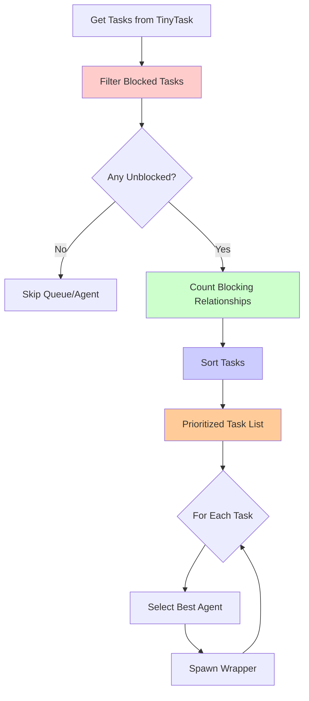
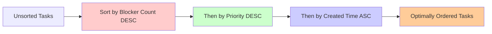
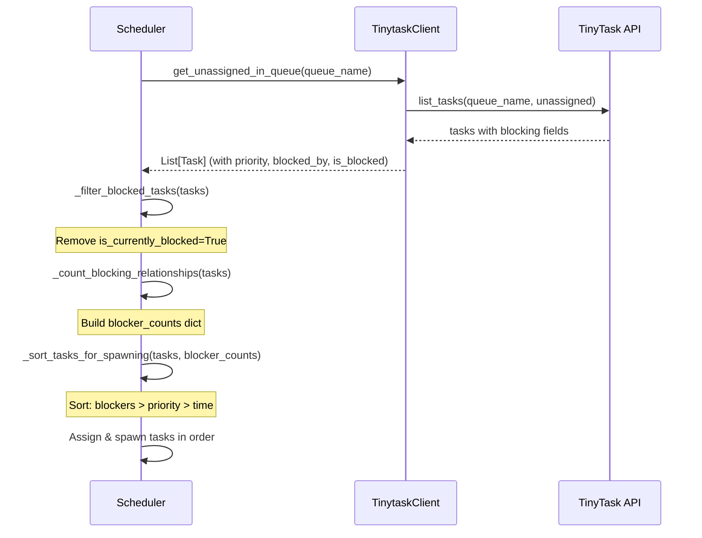
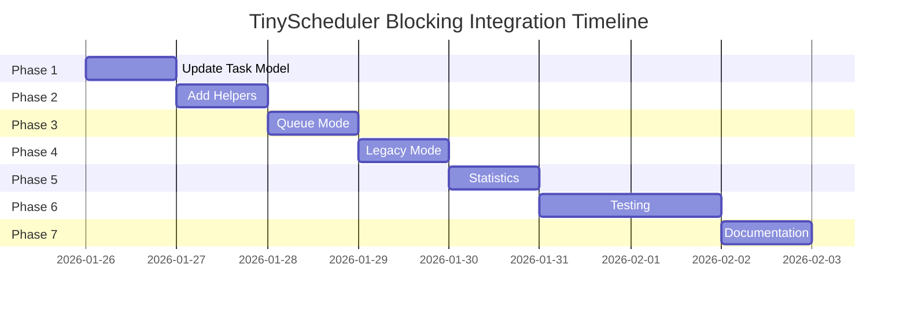

# TinyScheduler - Task Blocking Integration Plan

## Overview

Integrate TinyTask's new task blocking feature into TinyScheduler to:
1. **Prevent spawning blocked tasks** - Don't assign agents to tasks that are currently blocked
2. **Prioritize blocker tasks** - When ordering tasks for spawning, prioritize tasks that are blocking other tasks

This ensures efficient task execution by unblocking dependent tasks as quickly as possible.

---

## Current State Analysis

### TinyScheduler Task Flow

**Queue-Based Mode** (modern, with agent-control.json):
1. Scan existing leases, reclaim stale ones
2. Query unassigned tasks from each queue via [`get_unassigned_in_queue()`](../../src/scheduler/tinytask_client.py:413)
3. Assign tasks to agents with most available capacity
4. Spawn Goose wrappers for assigned tasks
5. Query already-assigned idle tasks for each agent via [`list_idle_tasks()`](../../src/scheduler/tinytask_client.py:211)
6. Spawn wrappers for already-assigned tasks

**Legacy Mode** (backward compatible):
1. Scan existing leases, reclaim stale ones
2. For each agent, query idle tasks via [`list_idle_tasks()`](../../src/scheduler/tinytask_client.py:211)
3. Spawn wrappers up to agent's concurrency limit

**Current Limitations**:
- No awareness of task blocking relationships
- No task priority sorting
- Tasks processed in order returned by TinyTask API
- Blocked tasks would be spawned (wasting agent slots)

### TinyTask Blocking Feature

**New Fields** (from provided implementation plan):
- `blocked_by_task_id`: INTEGER (nullable) - ID of blocking task
- `is_currently_blocked`: BOOLEAN (computed) - True if blocking task exists and status != 'complete'
- `priority`: INTEGER - Task priority for sorting

**Blocking Semantics**:
- Task is blocked if `blocked_by_task_id` is set AND blocking task is not complete
- When blocking task completes, blocked tasks automatically become unblocked
- When blocking task reopens, blocked tasks become blocked again
- Blocking relationship persists even when blocker is complete

---

## Integration Requirements

### Functional Requirements

1. **FR-1: Filter Blocked Tasks**
   - TinyScheduler MUST NOT spawn tasks where `is_currently_blocked = true`
   - Blocked tasks MUST be skipped in both queue-based and legacy modes
   - Blocked task count MUST be logged for observability

2. **FR-2: Prioritize Blocker Tasks**
   - Tasks that block other tasks MUST be spawned before non-blocker tasks
   - Within blocker tasks, sort by number of tasks blocked (descending)
   - Within same blocker count, sort by task priority (descending)
   - Within same priority, sort by creation time (ascending - FIFO)

3. **FR-3: Maintain Reconciliation Guarantees**
   - Filtering and sorting MUST NOT break idempotency
   - Must work with both queue-based and legacy modes
   - Must work when tinytask returns incomplete blocking data

### Non-Functional Requirements

1. **NFR-1: Performance**
   - Sorting overhead MUST be O(n log n) where n = tasks per queue
   - Blocking relationship counting MUST be O(n)
   - No additional API calls to TinyTask

2. **NFR-2: Observability**
   - Log blocked task count per reconciliation pass
   - Log when blocker tasks are prioritized
   - Include blocking stats in reconciliation summary

3. **NFR-3: Backward Compatibility**
   - Work with TinyTask instances without blocking feature (graceful degradation)
   - Legacy mode continues to work unchanged
   - No breaking changes to existing config

---

## Architecture Design

### Component Changes

#### 1. Task Data Model ([`src/scheduler/tinytask_client.py`](../../src/scheduler/tinytask_client.py:17-50))

```python
@dataclass
class Task:
    """Represents a tinytask task."""
    
    task_id: str
    agent: str
    status: str
    recipe: Optional[str] = None
    created_at: Optional[str] = None
    metadata: Dict[str, Any] = None
    
    # NEW FIELDS
    priority: int = 0  # Default priority
    blocked_by_task_id: Optional[int] = None
    is_currently_blocked: bool = False
    
    @classmethod
    def from_dict(cls, data: Dict) -> "Task":
        """Create Task from dictionary."""
        return cls(
            task_id=str(data.get('id', data.get('task_id', ''))),
            agent=data.get('assigned_to', data.get('agent', '')),
            status=data.get('status', 'idle'),
            recipe=data.get('recipe'),
            created_at=data.get('created_at'),
            metadata=data.get('metadata', {}),
            # NEW
            priority=data.get('priority', 0),
            blocked_by_task_id=data.get('blocked_by_task_id'),
            is_currently_blocked=data.get('is_currently_blocked', False),
        )
```

**Rationale**:
- Minimal changes to existing dataclass
- Default values ensure backward compatibility
- `from_dict()` handles missing fields gracefully

#### 2. Task Filtering Logic ([`src/scheduler/scheduler.py`](../../src/scheduler/scheduler.py))

```python
def _filter_blocked_tasks(self, tasks: List[Task]) -> Tuple[List[Task], int]:
    """
    Filter out blocked tasks.
    
    Args:
        tasks: List of tasks to filter
        
    Returns:
        Tuple of (unblocked_tasks, blocked_count)
    """
    unblocked = []
    blocked_count = 0
    
    for task in tasks:
        if task.is_currently_blocked:
            self.logger.debug(
                f"Task {task.task_id} is blocked by task {task.blocked_by_task_id}, skipping"
            )
            blocked_count += 1
        else:
            unblocked.append(task)
    
    if blocked_count > 0:
        self.logger.info(f"Filtered out {blocked_count} blocked task(s)")
    
    return unblocked, blocked_count
```

**Rationale**:
- Centralized filtering logic
- Returns count for stats tracking
- Graceful handling of missing blocking data

#### 3. Blocker Counting Logic ([`src/scheduler/scheduler.py`](../../src/scheduler/scheduler.py))

```python
def _count_blocking_relationships(self, tasks: List[Task]) -> Dict[str, int]:
    """
    Count how many tasks each task is blocking.
    
    This helps prioritize tasks that unblock the most other tasks.
    
    Args:
        tasks: List of all tasks (blocked and unblocked)
        
    Returns:
        Dict mapping task_id to count of tasks it blocks
    """
    blocker_counts = {}
    
    # Build set of task IDs we have
    task_ids = {task.task_id for task in tasks}
    
    # Count blocking relationships
    for task in tasks:
        if task.blocked_by_task_id:
            blocker_id = str(task.blocked_by_task_id)
            if blocker_id in task_ids:
                blocker_counts[blocker_id] = blocker_counts.get(blocker_id, 0) + 1
    
    return blocker_counts
```

**Rationale**:
- Only counts blocking relationships within current task set
- O(n) complexity
- Handles string/int task_id mismatches

#### 4. Task Sorting Logic ([`src/scheduler/scheduler.py`](../../src/scheduler/scheduler.py))

```python
def _sort_tasks_for_spawning(
    self, 
    tasks: List[Task], 
    blocker_counts: Dict[str, int]
) -> List[Task]:
    """
    Sort tasks for optimal spawning order.
    
    Priority order:
    1. Tasks blocking other tasks (most blockers first)
    2. Task priority (higher priority first)
    3. Creation time (older tasks first - FIFO)
    
    Args:
        tasks: List of tasks to sort
        blocker_counts: Dict of task_id -> count of tasks it blocks
        
    Returns:
        Sorted list of tasks
    """
    def sort_key(task: Task):
        # Blocker count (descending - negate for sorting)
        blocker_count = blocker_counts.get(task.task_id, 0)
        
        # Priority (descending - negate for sorting)
        priority = task.priority
        
        # Creation time (ascending - older first)
        # Handle missing created_at gracefully
        created_at = task.created_at or "9999-99-99"
        
        return (-blocker_count, -priority, created_at)
    
    sorted_tasks = sorted(tasks, key=sort_key)
    
    # Log if we have blocker tasks
    blocker_tasks = [t for t in sorted_tasks if blocker_counts.get(t.task_id, 0) > 0]
    if blocker_tasks:
        self.logger.info(
            f"Prioritizing {len(blocker_tasks)} blocker task(s) "
            f"(blocking {sum(blocker_counts.values())} tasks)"
        )
        for task in blocker_tasks[:5]:  # Log top 5
            count = blocker_counts[task.task_id]
            self.logger.debug(
                f"  Task {task.task_id} blocks {count} task(s) "
                f"(priority={task.priority})"
            )
    
    return sorted_tasks
```

**Rationale**:
- Multi-level sort ensures optimal spawning order
- Blockers first maximizes unblocking throughput
- FIFO for fairness within same priority
- Defensive handling of missing data

---

## Implementation Plan

### Phase 1: Update Task Data Model

**Files Modified**:
- [`src/scheduler/tinytask_client.py`](../../src/scheduler/tinytask_client.py)

**Changes**:
1. Add `priority`, `blocked_by_task_id`, `is_currently_blocked` fields to [`Task`](../../src/scheduler/tinytask_client.py:17) dataclass
2. Update [`Task.from_dict()`](../../src/scheduler/tinytask_client.py:32) to parse new fields with defaults
3. Add docstring noting backward compatibility

**Testing**:
- Unit test: Task creation with new fields
- Unit test: Task creation without new fields (backward compat)
- Unit test: from_dict() with complete data
- Unit test: from_dict() with missing fields

**Estimated Effort**: 1 hour

---

### Phase 2: Add Filtering and Sorting Helpers

**Files Modified**:
- [`src/scheduler/scheduler.py`](../../src/scheduler/scheduler.py)

**Changes**:
1. Add `_filter_blocked_tasks()` method after existing helper methods
2. Add `_count_blocking_relationships()` method
3. Add `_sort_tasks_for_spawning()` method
4. Add comprehensive docstrings with examples

**Testing**:
- Unit test: Filter all unblocked tasks
- Unit test: Filter mixed blocked/unblocked
- Unit test: Filter all blocked tasks
- Unit test: Count blocking relationships
- Unit test: Sort by blocker count only
- Unit test: Sort by priority only
- Unit test: Sort by creation time only
- Unit test: Sort multi-level (blocker + priority + time)
- Unit test: Handle missing created_at

**Estimated Effort**: 2-3 hours

---

### Phase 3: Integrate into Queue-Based Mode

**Files Modified**:
- [`src/scheduler/scheduler.py`](../../src/scheduler/scheduler.py:242) - `_process_unassigned_tasks()`

**Changes** in `_process_unassigned_tasks()` (line ~282-323):

```python
# After getting tasks from queue
try:
    tasks = self.tinytask_client.get_unassigned_in_queue(queue_name, total_slots)
    self.logger.info(f"Found {len(tasks)} unassigned tasks in queue '{queue_name}'")
except Exception as e:
    self.logger.error(f"Failed to query unassigned tasks for queue '{queue_name}': {e}")
    stats['errors'] += 1
    continue

# NEW: Filter blocked tasks
tasks, blocked_count = self._filter_blocked_tasks(tasks)
stats['tasks_blocked'] = stats.get('tasks_blocked', 0) + blocked_count

if not tasks:
    self.logger.debug(f"No unblocked tasks available in queue '{queue_name}'")
    continue

# NEW: Count blocking relationships
blocker_counts = self._count_blocking_relationships(tasks)

# NEW: Sort for optimal spawning order
tasks = self._sort_tasks_for_spawning(tasks, blocker_counts)

# Continue with existing assignment logic
for task in tasks:
    # ... existing code ...
```

**Changes** in `_process_assigned_tasks()` (line ~325):

```python
# After getting idle tasks for agent
try:
    idle_tasks = self.tinytask_client.list_idle_tasks(agent_name, limit=available)
    self.logger.info(f"Found {len(idle_tasks)} idle tasks for agent '{agent_name}'")
except Exception as e:
    self.logger.error(f"Failed to query idle tasks for agent '{agent_name}': {e}")
    stats['errors'] += 1
    continue

# NEW: Filter blocked tasks
idle_tasks, blocked_count = self._filter_blocked_tasks(idle_tasks)
stats['tasks_blocked'] = stats.get('tasks_blocked', 0) + blocked_count

# Continue with existing spawn logic
for task in idle_tasks:
    # ... existing code ...
```

**Testing**:
- Integration test: Process queue with all unblocked tasks
- Integration test: Process queue with blocked tasks (should skip)
- Integration test: Process queue with blocker tasks (should prioritize)
- Integration test: Verify stats tracking

**Estimated Effort**: 2 hours

---

### Phase 4: Integrate into Legacy Mode

**Files Modified**:
- [`src/scheduler/scheduler.py`](../../src/scheduler/scheduler.py:465) - Legacy mode in `reconcile()`

**Changes** (line ~474):

```python
# Query idle tasks for this agent
try:
    idle_tasks = self.tinytask_client.list_idle_tasks(agent, limit=available)
    self.logger.info(f"Found {len(idle_tasks)} idle tasks for agent '{agent}'")
    
    # NEW: Filter blocked tasks
    idle_tasks, blocked_count = self._filter_blocked_tasks(idle_tasks)
    stats['tasks_blocked'] = stats.get('tasks_blocked', 0) + blocked_count
    
    # NEW: Count and sort (even in legacy mode, optimize within agent)
    if idle_tasks:
        blocker_counts = self._count_blocking_relationships(idle_tasks)
        idle_tasks = self._sort_tasks_for_spawning(idle_tasks, blocker_counts)
    
    for task in idle_tasks[:available]:
        # ... existing spawn logic ...
```

**Testing**:
- Integration test: Legacy mode with blocked tasks
- Integration test: Legacy mode with blocker tasks
- Integration test: Verify backward compatibility

**Estimated Effort**: 1 hour

---

### Phase 5: Update Statistics and Logging

**Files Modified**:
- [`src/scheduler/scheduler.py`](../../src/scheduler/scheduler.py:501) - `reconcile()` summary logging

**Changes** (line ~501-510):

```python
# Log summary
self.logger.info("=== Reconciliation Summary ===")
self.logger.info(f"Leases scanned: {stats['leases_scanned']}")
self.logger.info(f"Leases reclaimed: {stats['leases_reclaimed']}")
self.logger.info(f"Tasks spawned: {stats['tasks_spawned']}")
self.logger.info(f"Already-assigned tasks spawned: {stats['assigned_spawned']}")
self.logger.info(f"Unassigned tasks matched: {stats['unassigned_matched']}")
# NEW
self.logger.info(f"Blocked tasks skipped: {stats.get('tasks_blocked', 0)}")
self.logger.info(f"Errors: {stats['errors']}")
```

**Testing**:
- Verify stats in log output
- Verify stats in dry-run mode

**Estimated Effort**: 30 minutes

---

### Phase 6: Update Tests

**Files Modified**:
- [`tests/scheduler/test_scheduler_queue.py`](../../tests/scheduler/test_scheduler_queue.py)
- New file: `tests/scheduler/test_blocking.py`

**New Tests**:
1. `test_filter_blocked_tasks_all_unblocked`
2. `test_filter_blocked_tasks_mixed`
3. `test_filter_blocked_tasks_all_blocked`
4. `test_count_blocking_relationships_simple`
5. `test_count_blocking_relationships_multiple`
6. `test_count_blocking_relationships_chain`
7. `test_sort_tasks_by_blocker_count`
8. `test_sort_tasks_by_priority`
9. `test_sort_tasks_by_creation_time`
10. `test_sort_tasks_multilevel`
11. `test_integration_queue_mode_with_blocked_tasks`
12. `test_integration_legacy_mode_with_blocked_tasks`
13. `test_backward_compatibility_no_blocking_fields`

**Estimated Effort**: 3-4 hours

---

### Phase 7: Documentation Updates

**Files Modified**:
- [`docs/tinyscheduler-README.md`](../../docs/tinyscheduler-README.md)
- [`docs/technical/tinyscheduler-operations.md`](../../docs/technical/tinyscheduler-operations.md)
- This file: [`docs/technical/tinyscheduler-blocking-integration.md`](../../docs/technical/tinyscheduler-blocking-integration.md)

**Updates**:
1. Add blocking feature to README features list
2. Document blocking behavior in operations guide
3. Add troubleshooting section for blocked tasks
4. Update architecture diagrams

**Estimated Effort**: 1-2 hours

---

## Mermaid Diagrams

### Task Filtering and Sorting Flow



### Task Sorting Priority



### Blocking Relationship Example

```mermaid
graph TD
    T1[Task 1: Setup DB] -->|blocks| T2[Task 2: Migrate Schema]
    T1 -->|blocks| T3[Task 3: Seed Data]
    T2 -->|blocks| T4[Task 4: Run Tests]
    T3 -->|blocks| T4
    
    T1:::priority
    T2:::normal
    T3:::normal
    T4:::blocked
    
    classDef priority fill:#90EE90,stroke:#333,stroke-width:4px
    classDef normal fill:#87CEEB,stroke:#333,stroke-width:2px
    classDef blocked fill:#FFB6C1,stroke:#333,stroke-width:2px
    
    Note[Spawning Order:<br/>1. T1 (blocks 2 tasks)<br/>2. T2 & T3 (block 1 task each)<br/>3. T4 (blocked until 2 & 3 complete)]
```

### Integration Points



---

## Edge Cases and Handling

### 1. Backward Compatibility

**Scenario**: TinyTask doesn't have blocking feature yet

**Handling**:
- New fields default to safe values (`priority=0`, `blocked_by_task_id=None`, `is_currently_blocked=False`)
- Filtering passes all tasks through
- Sorting falls back to priority + creation time
- No functional change

**Test**: Run against TinyTask without blocking fields

---

### 2. Circular Blocking

**Scenario**: Task A blocks Task B, Task B blocks Task A (should be prevented by TinyTask)

**Handling**:
- TinyScheduler doesn't validate circular blocking (TinyTask's responsibility)
- Both tasks would show `is_currently_blocked=True`
- Scheduler filters both out, logs count
- Human intervention needed to fix in TinyTask

**Test**: Mock circular blocking, verify both filtered

---

### 3. Long Blocking Chains

**Scenario**: A → B → C → D (each blocks next)

**Handling**:
- TinyScheduler only sees immediate blocking relationships
- Only Task A (unblocked) gets spawned
- When A completes, TinyTask unblocks B
- Next reconciliation pass spawns B
- Progressive unblocking over multiple passes

**Test**: Create chain, verify sequential spawning

---

### 4. Orphaned Blocking References

**Scenario**: Task A blocked by Task 999 (doesn't exist)

**Handling**:
- TinyTask should set `is_currently_blocked=False` (blocking task doesn't exist)
- If TinyTask fails, scheduler still filters based on `is_currently_blocked` flag
- Relies on TinyTask's computed blocking state

**Test**: Mock orphaned blocker, verify TinyTask logic

---

### 5. High-Priority Blocked Tasks

**Scenario**: Task A (priority 10, blocked) vs Task B (priority 1, unblocked)

**Handling**:
- Filtering happens BEFORE sorting
- Task A filtered out despite high priority
- Task B spawned
- Correct behavior - blocked tasks cannot run regardless of priority

**Test**: Verify blocked high-priority tasks skipped

---

### 6. Blocker Task Already Running

**Scenario**: Task A blocks Task B, but Task A already has a lease

**Handling**:
- Task B still shows `is_currently_blocked=True` (A is 'working', not 'complete')
- Scheduler filters Task B out
- When A completes and lease removed, TinyTask sets `is_currently_blocked=False` for B
- Next reconciliation pass spawns B

**Test**: Create lease for blocker, verify blocked task not spawned

---

## Rollback Plan

If issues arise during deployment:

1. **Phase 1-2 (Data Model)**: Safe - only adds fields, doesn't change behavior
2. **Phase 3-4 (Filtering/Sorting)**: Revert commits for scheduler.py changes
3. **Emergency**: Add environment variable `TINYSCHEDULER_DISABLE_BLOCKING=1` to skip filtering/sorting

**Rollback Command**:
```bash
git revert <commit-hash>
# OR
export TINYSCHEDULER_DISABLE_BLOCKING=1
./tinyscheduler run --once
```

---

## Performance Impact

### Time Complexity

| Operation | Before | After | Impact |
|-----------|--------|-------|--------|
| Get tasks | O(1) API call | O(1) API call | None |
| Filter tasks | N/A | O(n) | Minimal |
| Count blockers | N/A | O(n) | Minimal |
| Sort tasks | None | O(n log n) | Low |
| Spawn tasks | O(n) | O(n) | None |

**Overall**: O(n log n) where n = tasks per queue (typically 10-100)

### Space Complexity

- Blocker counts dict: O(n) additional memory
- Sorted task list: No additional memory (in-place sort)

**Overall**: O(n) additional memory

### Reconciliation Time

- Before: ~1-2 seconds per pass
- After: +50-100ms for filtering/sorting (estimated)
- **Impact**: Negligible (<5% increase)

---

## Monitoring and Observability

### New Log Messages

```
INFO: Filtered out 5 blocked task(s)
INFO: Prioritizing 3 blocker task(s) (blocking 8 tasks)
DEBUG: Task 123 blocks 3 task(s) (priority=5)
INFO: Task 123 is blocked by task 456, skipping
INFO: Blocked tasks skipped: 5
```

### Stats Tracking

New stat: `tasks_blocked` - Count of blocked tasks filtered per pass

### Metrics (if using workload reporter)

Consider adding:
- Total blocked tasks per queue
- Average blocking chain length
- Blocker task completion time

---

## Testing Strategy

### Unit Tests (10-12 tests)

**Test File**: `tests/scheduler/test_blocking.py`

1. `test_task_from_dict_with_blocking_fields` - Parse new fields
2. `test_task_from_dict_without_blocking_fields` - Backward compat
3. `test_filter_blocked_tasks_empty` - Empty list
4. `test_filter_blocked_tasks_all_unblocked` - No filtering
5. `test_filter_blocked_tasks_mixed` - Some blocked
6. `test_filter_blocked_tasks_all_blocked` - All filtered
7. `test_count_blocking_relationships_empty` - No relationships
8. `test_count_blocking_relationships_simple` - One blocker
9. `test_count_blocking_relationships_multiple` - Multiple blockers
10. `test_sort_tasks_by_blocker_count` - Blocker priority
11. `test_sort_tasks_by_priority` - Priority sorting
12. `test_sort_tasks_multilevel` - Combined sorting

### Integration Tests (6-8 tests)

**Test File**: `tests/scheduler/test_scheduler_queue.py`

1. `test_queue_mode_filters_blocked_tasks` - Queue mode integration
2. `test_queue_mode_prioritizes_blockers` - Blocker sorting
3. `test_legacy_mode_filters_blocked_tasks` - Legacy mode integration
4. `test_backward_compat_no_blocking_fields` - Old TinyTask version
5. `test_high_priority_blocked_task_filtered` - Priority edge case
6. `test_blocker_already_running` - Lease edge case
7. `test_all_tasks_blocked_skips_queue` - Empty after filtering
8. `test_stats_tracking_blocked_count` - Stats verification

### Manual Testing

1. Run against real TinyTask with blocking feature
2. Create blocking relationships in TinyTask
3. Observe scheduler behavior with `--dry-run`
4. Verify blocked tasks not spawned
5. Verify blocker tasks spawned first
6. Check logs for new messages

---

## Implementation Sequence



**Total Estimated Effort**: 8-10 hours (1-2 days)

---

## Success Criteria

### Must Have
- ✅ Blocked tasks are never spawned
- ✅ Blocker tasks spawned before non-blocker tasks
- ✅ Works in both queue-based and legacy modes
- ✅ Backward compatible with old TinyTask versions
- ✅ All tests pass
- ✅ No performance degradation (>5% reconciliation time increase)

### Should Have
- ✅ Comprehensive logging
- ✅ Stats tracking for blocked tasks
- ✅ Documentation updated
- ✅ Edge cases handled gracefully

### Nice to Have
- 🔄 Metrics dashboard for blocking relationships
- 🔄 Alert when many tasks blocked
- 🔄 Blocking relationship visualization

---

## Open Questions

1. **Q**: Should we add a config flag to disable blocking-aware behavior?
   **A**: Yes - add `TINYSCHEDULER_DISABLE_BLOCKING` env var for emergency rollback

2. **Q**: How to handle tasks blocked by completed tasks? (is_currently_blocked=False but blocked_by_task_id set)
   **A**: TinyTask handles this - we only check `is_currently_blocked` flag

3. **Q**: Should we recursively resolve blocking chains?
   **A**: No - TinyTask computes `is_currently_blocked`, we trust that

4. **Q**: What if TinyTask's blocking computation is slow/incorrect?
   **A**: Out of scope - TinyTask's responsibility. We consume computed field.

---

## Future Enhancements (Out of Scope)

1. **Blocking Chain Visualization**: Show dependency graphs in logs/reports
2. **Predictive Scheduling**: Estimate unblocking time based on agent workload
3. **Priority Boosting**: Increase blocker task priority automatically
4. **Deadlock Detection**: Alert on circular blocking (if TinyTask allows it)
5. **Blocking History**: Track how long tasks were blocked

---

## References

- [TinyTask Blocking Feature - Implementation Plan](task-blocking-implementation-plan.md) (provided doc)
- [TinyScheduler README](../../docs/tinyscheduler-README.md)
- [TinyScheduler Operations Guide](../../docs/technical/tinyscheduler-operations.md)
- [Agent Registry Documentation](../../docs/technical/agent-control.json)
- [TinytaskClient Source](../../src/scheduler/tinytask_client.py)
- [Scheduler Source](../../src/scheduler/scheduler.py)

---

## Summary

This integration adds **task blocking awareness** to TinyScheduler with:

**Minimal Changes**:
- 3 new fields in Task dataclass
- 3 new helper methods in Scheduler
- Integration at 3 points (unassigned queue, assigned tasks, legacy mode)

**Maximum Impact**:
- Blocked tasks never consume agent slots
- Blocker tasks unblock others faster
- Efficient resource utilization
- Full backward compatibility

**Implementation Time**: 8-10 hours

**Risk Level**: Low (defensive coding, backward compatible, easy rollback)
