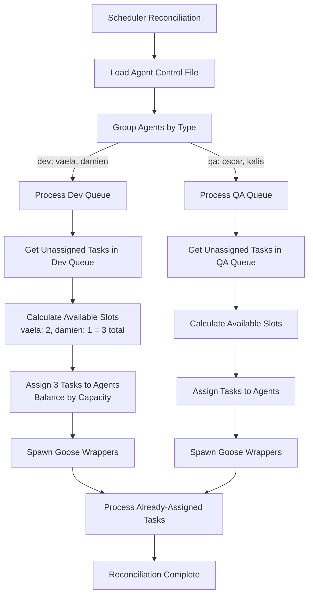

# TinyScheduler Queue Integration - Executive Summary

## Problem Statement

Tinytask has been updated with a new queue and assignee model:
- **Queues** represent team/functional areas: `dev`, `qa`, `product`, `architect`
- **Assignees** represent individual agents: `vaela`, `damien`, `oscar`, `kalis`
- Tasks can be unassigned (in a queue, waiting for any agent of that type)

Currently, TinyScheduler queries by agent name only, missing the opportunity to intelligently assign unassigned tasks to available agents of the appropriate type.

## Solution Overview

Update TinyScheduler to:
1. **Use an agent control file** to map agents to their types/queues
2. **Query by queue** to find unassigned tasks
3. **Intelligently match** unassigned tasks to available agents
4. **Maintain backward compatibility** for already-assigned tasks

**Key Concept**: `queue_name` in tinytask = `agentType` in agent control file

## Architecture Changes

### Before (Current)
```
For each agent (vaela, damien, oscar):
  ├─ Query: "Give me idle tasks assigned to <agent>"
  └─ Spawn tasks up to agent's capacity
  
Limitation: Can't see or assign unassigned tasks
```

### After (Proposed)
```
Phase 1: Process Unassigned Tasks
  For each queue (dev, qa):
    ├─ Get all agents of this type (dev: [vaela, damien])
    ├─ Calculate total available slots
    ├─ Query: "Give me unassigned tasks in <queue>"
    ├─ Assign tasks to agents with most capacity
    └─ Spawn wrappers
    
Phase 2: Process Already-Assigned Tasks
  For each agent (vaela, damien, oscar):
    ├─ Query: "Give me idle tasks assigned to <agent>"
    └─ Spawn tasks up to agent's capacity
```

## Agent Control File

### Location (Configurable)

**Environment Variable**: `TINYSCHEDULER_AGENT_CONTROL_FILE`

**Priority**:
1. Use path from `TINYSCHEDULER_AGENT_CONTROL_FILE` if set (can be absolute or relative)
2. Check `{base_path}/config/agent-control.json` (recommended location)
3. Fall back to `{base_path}/agent-control.json`

**Sample File**: [`workspace/calypso/docs/technical/agent-control.json`](./agent-control.json) (reference only)

### Format
```json
[
  {
    "agentName": "vaela",
    "agentType": "dev"
  },
  {
    "agentName": "damien",
    "agentType": "dev"
  },
  {
    "agentName": "oscar",
    "agentType": "qa"
  }
]
```

### Configuration Example
```bash
# In tinyscheduler.env
TINYSCHEDULER_AGENT_CONTROL_FILE=config/agent-control.json

# Or use absolute path
TINYSCHEDULER_AGENT_CONTROL_FILE=/etc/tinyscheduler/agents.json
```

### Benefits
- Single source of truth for agent configuration
- Easy to add/remove agents without code changes
- Configurable location for different environments
- Extensible for future attributes (capabilities, priority, etc.)

## Flow Diagram



## Implementation Plan

### 5 Stories, ~11-17 Days Total

| Story | Description | Effort | Dependencies |
|-------|-------------|--------|--------------|
| **1. Agent Registry** | Create agent control file loader and registry | 3-5 days | None |
| **2. Enhanced Client** | Add queue-based query methods to tinytask client | 3-5 days | None |
| **3. Scheduler Logic** | Implement queue-based reconciliation algorithm | 5-7 days | Stories 1, 2 |
| **4. Configuration** | Add config validation and documentation | 2-3 days | Story 1 |
| **5. Integration** | End-to-end tests and documentation | 3-5 days | Stories 1-4 |

### Key Files Created/Modified

**New Files**:
- [`src/scheduler/agent_registry.py`](../../src/scheduler/agent_registry.py) - Agent control file loader
- [`tests/scheduler/test_agent_registry.py`](../../tests/scheduler/test_agent_registry.py) - Registry tests
- [`tests/scheduler/test_integration_queue.py`](../../tests/scheduler/test_integration_queue.py) - Integration tests
- [`docs/technical/tinyscheduler-migration-guide.md`](./tinyscheduler-migration-guide.md) - Migration guide

**Modified Files**:
- [`src/scheduler/scheduler.py`](../../src/scheduler/scheduler.py) - Queue-based reconciliation logic
- [`src/scheduler/tinytask_client.py`](../../src/scheduler/tinytask_client.py) - New query methods
- [`src/scheduler/config.py`](../../src/scheduler/config.py) - Agent control file path
- [`docs/tinyscheduler-README.md`](../tinyscheduler-README.md) - Documentation updates

## Example Scenario

**Setup**:
- Dev queue has 5 unassigned tasks
- QA queue has 3 unassigned tasks
- Agent pool:
  - `vaela` (dev): 2/3 slots used, 1 available
  - `damien` (dev): 0/2 slots used, 2 available
  - `oscar` (qa): 1/1 slots used, 0 available
  - `kalis` (qa): 0/2 slots used, 2 available

**Current Behavior**:
- Unassigned tasks sit in queues forever
- Only 0 tasks processed (none assigned to agents)

**New Behavior**:
1. Process dev queue: 3 available slots (1 + 2)
   - Assign task #1 to `damien` (has 2 slots)
   - Assign task #2 to `damien` (has 1 slot)
   - Assign task #3 to `vaela` (has 1 slot)
   - Spawn 3 wrappers

2. Process qa queue: 2 available slots (0 + 2)
   - Assign task #4 to `kalis` (has 2 slots)
   - Assign task #5 to `kalis` (has 1 slot)
   - Spawn 2 wrappers

**Result**: 5 tasks processed instead of 0

## Benefits

### Operational
- ✅ **Better Resource Utilization**: All available agent capacity used
- ✅ **Load Balancing**: Tasks distributed based on agent availability
- ✅ **Flexibility**: Easy to add/remove agents without code changes
- ✅ **Scalability**: Scale individual queues independently

### Technical
- ✅ **Maintainability**: Agent config in one place
- ✅ **Extensibility**: Easy to add new agent attributes
- ✅ **Backward Compatibility**: Existing assigned tasks still work
- ✅ **Clear Separation**: Queue (team capacity) vs. agent (individual workload)

## Risk Mitigation

| Risk | Mitigation |
|------|------------|
| Tinytask MCP tools not ready | Implement mock server; phased rollout |
| Agent control file out of sync | Validation on startup; reload capability |
| Performance impact | Benchmarking; query optimization |
| Breaking existing deployments | Backward compatibility mode; gradual migration |

## Success Criteria

- ✅ Unassigned tasks automatically assigned to available agents
- ✅ Load balanced across agent pool based on capacity
- ✅ Already-assigned tasks continue to work
- ✅ Zero breaking changes to existing deployments
- ✅ All existing tests pass
- ✅ 90%+ test coverage on new code
- ✅ Reconciliation completes in <10 seconds for 100 tasks

## Next Steps

1. **Review and approve this plan**
2. **Coordinate with tinytask team** on MCP tool availability
3. **Create implementation tasks** in project tracker
4. **Begin Story 1** (Agent Registry Foundation)

## Documentation

- **Technical Plan**: [`tinyscheduler-queue-integration.md`](./tinyscheduler-queue-integration.md)
- **Product Stories**: [`../product-stories/tinyscheduler-queue-integration.md`](../product-stories/tinyscheduler-queue-integration.md)
- **Agent Control File**: [`agent-control.json`](./agent-control.json)
- **Tinytask Changes**: [`tinytask-subtasks.md`](./tinytask-subtasks.md)
