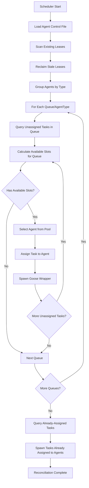

# TinyScheduler Queue Integration Technical Plan

## Overview

This document outlines the technical plan for updating TinyScheduler to integrate with tinytask's new queue and assignee model. The key change is that tinytask now supports both **queues** (team/functional areas like `dev`, `qa`, `product`) and **assignees** (individual agents like `vaela`, `damien`, `oscar`).

**Critical Concept**: `queue_name` in tinytask = `agentType` in the agent control file.

## Current State

### Current TinyScheduler Behavior
- Queries tinytask using [`list_idle_tasks(agent, limit)`](../../src/scheduler/tinytask_client.py:211) for each configured agent
- Uses `TINYSCHEDULER_AGENT_LIMITS` config: `{"dispatcher": 1, "architect": 1}`
- Spawns tasks based on available slots per agent
- Agent names directly correspond to both the queue and the assignee

### Current Query Pattern
```python
# In scheduler.py reconcile_once()
for agent, available in available_slots.items():
    idle_tasks = self.tinytask_client.list_idle_tasks(agent, limit=available)
    # Spawn tasks for this agent
```

### Limitations
- Cannot distinguish between queue (team) and assignee (individual)
- Cannot intelligently assign unassigned tasks to available agents
- Tightly couples agent identity to task assignment

## New Tinytask Model

### Key Changes in Tinytask
- **`queue_name`**: Team/functional area (`dev`, `qa`, `product`, `architect`)
- **`assigned_to`**: Individual agent name (`vaela`, `damien`, `oscar`, `kalis`)
- Tasks can be:
  - In a queue but unassigned (`queue_name` set, `assigned_to` NULL)
  - Assigned to specific agent (`assigned_to` set)
  - Both queue and assignee set

### New MCP Tools Available
```typescript
// Get all tasks in a queue (assigned or unassigned)
get_queue_tasks({
  queue_name: string,
  assigned_to?: string,
  status?: 'idle' | 'working' | 'complete',
  include_subtasks?: boolean
})

// Get only unassigned tasks in queue
get_unassigned_in_queue({
  queue_name: string
})

// Enhanced list_tasks with queue filter
list_tasks({
  queue_name?: string,
  assigned_to?: string,
  status?: 'idle' | 'working' | 'complete',
  // ... other filters
})
```

## Agent Control File

### Purpose
Centralize agent configuration with their types/capabilities in a structured data model.

### Schema
```json
[
  {
    "agentName": "vaela",
    "agentType": "dev"
  },
  {
    "agentName": "damien",
    "agentType": "dev"
  },
  {
    "agentName": "oscar",
    "agentType": "qa"
  },
  {
    "agentName": "kalis",
    "agentType": "qa"
  }
]
```

### Location (Configurable)

**Environment Variable**: `TINYSCHEDULER_AGENT_CONTROL_FILE`

**Recommended Locations**:
1. **Production**: `{base_path}/config/agent-control.json`
2. **Development**: `{base_path}/agent-control.json`
3. **Custom**: Any absolute or relative path

**Sample File**: `workspace/calypso/docs/technical/agent-control.json` (for reference only)

### Future Extensibility
The data model can be extended with additional attributes:
```json
{
  "agentName": "vaela",
  "agentType": "dev",
  "maxConcurrency": 2,
  "enabled": true,
  "priority": 10,
  "capabilities": ["typescript", "python", "testing"]
}
```

## New TinyScheduler Architecture

### High-Level Flow



### Key Algorithm Changes

#### Phase 1: Build Agent Registry
```python
# Load agent control file
agents = load_agent_control_file()
# agents = [{"agentName": "vaela", "agentType": "dev"}, ...]

# Group by agentType
agents_by_type = {}
for agent in agents:
    agent_type = agent['agentType']
    if agent_type not in agents_by_type:
        agents_by_type[agent_type] = []
    agents_by_type[agent_type].append(agent['agentName'])

# agents_by_type = {
#   "dev": ["vaela", "damien"],
#   "qa": ["oscar", "kalis", "karma", "pirstin"]
# }
```

#### Phase 2: Query by Queue
```python
# For each queue (agentType)
for queue_name, agent_pool in agents_by_type.items():
    # Get unassigned tasks in this queue
    unassigned_tasks = tinytask_client.get_unassigned_in_queue(queue_name)
    
    # Calculate available slots across all agents in pool
    total_slots = 0
    for agent_name in agent_pool:
        active_count = lease_store.count_by_agent(agent_name)
        agent_limit = config.agent_limits.get(agent_name, 1)
        available = max(0, agent_limit - active_count)
        total_slots += available
    
    # Assign unassigned tasks to agents in pool
    tasks_to_assign = unassigned_tasks[:total_slots]
    for task in tasks_to_assign:
        # Select agent with most available capacity
        agent = select_best_agent(agent_pool, lease_store, config)
        
        # Spawn wrapper with agent assignment
        spawn_wrapper(task.task_id, agent, queue_name)
```

#### Phase 3: Process Already-Assigned Tasks
```python
# Also check for tasks already assigned to specific agents
for agent_name in all_agents:
    # Get idle tasks already assigned to this agent
    assigned_tasks = tinytask_client.list_idle_tasks(agent_name)
    
    # Calculate available slots for this specific agent
    active_count = lease_store.count_by_agent(agent_name)
    agent_limit = config.agent_limits.get(agent_name, 1)
    available = max(0, agent_limit - active_count)
    
    # Spawn tasks up to available slots
    for task in assigned_tasks[:available]:
        spawn_wrapper(task.task_id, agent_name, task.queue_name or agent.agentType)
```

## Implementation Details

### 1. Agent Control File Loader

**File**: [`src/scheduler/agent_registry.py`](../../src/scheduler/agent_registry.py) (new)

```python
"""Agent registry for loading and managing agent configurations."""

import json
from dataclasses import dataclass
from pathlib import Path
from typing import Dict, List, Optional


@dataclass
class AgentConfig:
    """Configuration for a single agent."""
    
    agent_name: str
    agent_type: str
    # Future extensions:
    # max_concurrency: int = 1
    # enabled: bool = True
    # priority: int = 0
    
    @classmethod
    def from_dict(cls, data: Dict) -> "AgentConfig":
        """Create AgentConfig from dictionary."""
        return cls(
            agent_name=data['agentName'],
            agent_type=data['agentType']
        )


class AgentRegistry:
    """Registry of agents and their configurations."""
    
    def __init__(self, control_file_path: Path):
        """
        Initialize agent registry.
        
        Args:
            control_file_path: Path to agent control JSON file
        """
        self.control_file_path = control_file_path
        self.agents: List[AgentConfig] = []
        self._agents_by_type: Dict[str, List[str]] = {}
        self._agents_by_name: Dict[str, AgentConfig] = {}
        
        self._load()
    
    def _load(self):
        """Load agents from control file."""
        if not self.control_file_path.exists():
            raise FileNotFoundError(f"Agent control file not found: {self.control_file_path}")
        
        with open(self.control_file_path) as f:
            data = json.load(f)
        
        # Parse agents
        self.agents = [AgentConfig.from_dict(item) for item in data]
        
        # Build indexes
        self._agents_by_type = {}
        self._agents_by_name = {}
        
        for agent in self.agents:
            # By type
            if agent.agent_type not in self._agents_by_type:
                self._agents_by_type[agent.agent_type] = []
            self._agents_by_type[agent.agent_type].append(agent.agent_name)
            
            # By name
            self._agents_by_name[agent.agent_name] = agent
    
    def get_agents_by_type(self, agent_type: str) -> List[str]:
        """Get list of agent names for a given type."""
        return self._agents_by_type.get(agent_type, [])
    
    def get_agent_type(self, agent_name: str) -> Optional[str]:
        """Get agent type for a given agent name."""
        agent = self._agents_by_name.get(agent_name)
        return agent.agent_type if agent else None
    
    def get_all_types(self) -> List[str]:
        """Get list of all agent types (queues)."""
        return list(self._agents_by_type.keys())
    
    def get_all_agent_names(self) -> List[str]:
        """Get list of all agent names."""
        return [agent.agent_name for agent in self.agents]
    
    def reload(self):
        """Reload agents from control file."""
        self._load()
```

### 2. Enhanced Tinytask Client

**File**: [`src/scheduler/tinytask_client.py`](../../src/scheduler/tinytask_client.py) (update)

Add new methods to support queue-based queries:

```python
def get_queue_tasks(
    self,
    queue_name: str,
    assigned_to: Optional[str] = None,
    status: Optional[str] = None,
    limit: int = 100
) -> List[Task]:
    """
    Get tasks in a queue.
    
    Args:
        queue_name: Queue name to query
        assigned_to: Optional filter by assignee
        status: Optional filter by status
        limit: Maximum number of tasks
        
    Returns:
        List of Task objects
    """
    try:
        arguments = {
            'queue_name': queue_name,
            'limit': limit
        }
        if assigned_to:
            arguments['assigned_to'] = assigned_to
        if status:
            arguments['status'] = status
        
        result = self._run_async(
            self._call_tool('get_queue_tasks', arguments)
        )
        
        # Parse response
        if isinstance(result, dict):
            tasks_data = result.get('tasks', [])
        elif isinstance(result, list):
            tasks_data = result
        else:
            tasks_data = []
        
        return [Task.from_dict(task_data) for task_data in tasks_data]
    
    except (TinytaskConnectionError, TinytaskAPIError) as e:
        print(f"Warning: Failed to get queue tasks for '{queue_name}': {e}")
        return []


def get_unassigned_in_queue(self, queue_name: str, limit: int = 100) -> List[Task]:
    """
    Get unassigned tasks in a queue.
    
    Args:
        queue_name: Queue name to query
        limit: Maximum number of tasks
        
    Returns:
        List of unassigned Task objects
    """
    try:
        result = self._run_async(
            self._call_tool('get_unassigned_in_queue', {
                'queue_name': queue_name
            })
        )
        
        # Parse response
        if isinstance(result, dict):
            tasks_data = result.get('tasks', [])
        elif isinstance(result, list):
            tasks_data = result
        else:
            tasks_data = []
        
        return [Task.from_dict(task_data) for task_data in tasks_data][:limit]
    
    except (TinytaskConnectionError, TinytaskAPIError) as e:
        print(f"Warning: Failed to get unassigned tasks for queue '{queue_name}': {e}")
        return []


def assign_task(self, task_id: str, agent: str) -> bool:
    """
    Assign a task to an agent.
    
    Args:
        task_id: Task identifier
        agent: Agent name to assign to
        
    Returns:
        True if assignment succeeded
    """
    try:
        arguments = {
            'id': int(task_id),
            'assigned_to': agent
        }
        
        self._run_async(self._call_tool('update_task', arguments))
        return True
    
    except (TinytaskConnectionError, TinytaskAPIError) as e:
        print(f"Warning: Failed to assign task {task_id} to agent '{agent}': {e}")
        return False
```

### 3. Updated Scheduler Logic

**File**: [`src/scheduler/scheduler.py`](../../src/scheduler/scheduler.py) (update)

Key changes to [`reconcile_once()`](../../src/scheduler/scheduler.py:180) method:

```python
class Scheduler:
    def __init__(self, config: TinySchedulerConfig):
        self.config = config
        self.logger = logging.getLogger('tinyscheduler')
        self.lease_store = LeaseStore(config.running_dir, self.logger)
        self.tinytask_client = TinytaskClient(
            endpoint=config.mcp_endpoint,
            timeout=config.request_timeout_sec
        )
        
        # NEW: Load agent registry
        agent_control_path = config.base_path / "docs" / "technical" / "agent-control.json"
        self.agent_registry = AgentRegistry(agent_control_path)
    
    def reconcile_once(self) -> Dict:
        """Run one reconciliation pass with queue-based logic."""
        stats = {
            'leases_scanned': 0,
            'leases_reclaimed': 0,
            'tasks_spawned': 0,
            'unassigned_matched': 0,
            'assigned_spawned': 0,
            'errors': 0
        }
        
        self.logger.info("=" * 60)
        self.logger.info("Starting reconciliation pass (queue-based)")
        self.logger.info("=" * 60)
        
        # Step 1: Scan and reclaim stale leases (unchanged)
        self._scan_and_reclaim_leases(stats)
        
        # Step 2: Process unassigned tasks by queue
        self.logger.info("Step 2: Processing unassigned tasks by queue...")
        self._process_unassigned_tasks(stats)
        
        # Step 3: Process already-assigned tasks
        self.logger.info("Step 3: Processing already-assigned tasks...")
        self._process_assigned_tasks(stats)
        
        # Summary
        self._log_summary(stats)
        
        return stats
    
    def _process_unassigned_tasks(self, stats: Dict):
        """Process unassigned tasks in each queue."""
        # Get all queue types from agent registry
        queue_types = self.agent_registry.get_all_types()
        
        for queue_name in queue_types:
            self.logger.info(f"Processing queue: {queue_name}")
            
            # Get agents in this queue
            agent_pool = self.agent_registry.get_agents_by_type(queue_name)
            self.logger.debug(f"Agent pool for {queue_name}: {agent_pool}")
            
            # Calculate total available slots across agent pool
            available_by_agent = {}
            total_available = 0
            
            for agent_name in agent_pool:
                active_count = self.lease_store.count_by_agent(agent_name)
                agent_limit = self.config.agent_limits.get(agent_name, 1)
                available = max(0, agent_limit - active_count)
                available_by_agent[agent_name] = available
                total_available += available
                
                self.logger.debug(
                    f"  {agent_name}: {active_count}/{agent_limit} active, "
                    f"{available} slots available"
                )
            
            if total_available == 0:
                self.logger.info(f"No available slots for queue '{queue_name}'")
                continue
            
            # Get unassigned tasks in this queue
            try:
                unassigned_tasks = self.tinytask_client.get_unassigned_in_queue(
                    queue_name,
                    limit=total_available
                )
                self.logger.info(
                    f"Found {len(unassigned_tasks)} unassigned tasks in queue '{queue_name}'"
                )
                
                # Assign and spawn tasks
                for task in unassigned_tasks:
                    if total_available <= 0:
                        break
                    
                    # Select agent with most available capacity
                    best_agent = max(
                        available_by_agent.items(),
                        key=lambda x: x[1]
                    )[0]
                    
                    if available_by_agent[best_agent] <= 0:
                        break
                    
                    # Assign task to agent
                    if self.config.dry_run:
                        self.logger.info(
                            f"[DRY RUN] Would assign task {task.task_id} to "
                            f"agent '{best_agent}' (queue: {queue_name})"
                        )
                    else:
                        # Update task assignment in tinytask
                        if self.tinytask_client.assign_task(task.task_id, best_agent):
                            # Determine recipe
                            recipe = task.recipe or f"{best_agent}.yaml"
                            recipe_path = self.config.recipes_dir / recipe
                            
                            if not recipe_path.exists():
                                self.logger.warning(f"Recipe not found: {recipe_path}")
                                continue
                            
                            # Spawn wrapper
                            if self._spawn_wrapper(task.task_id, best_agent, recipe):
                                stats['tasks_spawned'] += 1
                                stats['unassigned_matched'] += 1
                                available_by_agent[best_agent] -= 1
                                total_available -= 1
                                self.logger.info(
                                    f"Assigned and spawned task {task.task_id} to "
                                    f"agent '{best_agent}' (queue: {queue_name})"
                                )
                            else:
                                stats['errors'] += 1
                        else:
                            self.logger.error(
                                f"Failed to assign task {task.task_id} to agent '{best_agent}'"
                            )
                            stats['errors'] += 1
            
            except Exception as e:
                self.logger.error(f"Error processing queue '{queue_name}': {e}")
                stats['errors'] += 1
    
    def _process_assigned_tasks(self, stats: Dict):
        """Process tasks already assigned to specific agents."""
        # Get all agent names from registry
        all_agents = self.agent_registry.get_all_agent_names()
        
        for agent_name in all_agents:
            # Calculate available slots for this agent
            active_count = self.lease_store.count_by_agent(agent_name)
            agent_limit = self.config.agent_limits.get(agent_name, 1)
            available = max(0, agent_limit - active_count)
            
            self.logger.debug(
                f"Agent '{agent_name}': {active_count}/{agent_limit} active, "
                f"{available} slots available"
            )
            
            if available <= 0:
                continue
            
            # Get idle tasks already assigned to this agent
            try:
                assigned_tasks = self.tinytask_client.list_idle_tasks(
                    agent_name,
                    limit=available
                )
                
                self.logger.info(
                    f"Found {len(assigned_tasks)} idle tasks assigned to '{agent_name}'"
                )
                
                # Spawn tasks up to available slots
                for task in assigned_tasks[:available]:
                    # Determine recipe and queue
                    agent_type = self.agent_registry.get_agent_type(agent_name)
                    recipe = task.recipe or f"{agent_name}.yaml"
                    recipe_path = self.config.recipes_dir / recipe
                    
                    if not recipe_path.exists():
                        self.logger.warning(f"Recipe not found: {recipe_path}")
                        continue
                    
                    # Spawn wrapper
                    if self.config.dry_run:
                        self.logger.info(
                            f"[DRY RUN] Would spawn task {task.task_id} for "
                            f"agent '{agent_name}' (already assigned)"
                        )
                    else:
                        if self._spawn_wrapper(task.task_id, agent_name, recipe):
                            stats['tasks_spawned'] += 1
                            stats['assigned_spawned'] += 1
                            self.logger.info(
                                f"Spawned task {task.task_id} for agent '{agent_name}'"
                            )
                        else:
                            stats['errors'] += 1
            
            except Exception as e:
                self.logger.error(
                    f"Error processing assigned tasks for agent '{agent_name}': {e}"
                )
                stats['errors'] += 1
```

### 4. Configuration Updates

**File**: [`src/scheduler/config.py`](../../src/scheduler/config.py) (update)

Add configuration for agent control file:

```python
class TinySchedulerConfig:
    """Configuration for TinyScheduler."""
    
    # ... existing fields ...
    
    @property
    def agent_control_file(self) -> Path:
        """Path to agent control JSON file."""
        env_path = os.getenv('TINYSCHEDULER_AGENT_CONTROL_FILE')
        if env_path:
            return Path(env_path)
        
        # Default location
        return self.base_path / "docs" / "technical" / "agent-control.json"
```

**File**: [`tinyscheduler.env`](../../tinyscheduler.env) (update)

Add optional override:

```bash
# Optional: Override agent control file location
# TINYSCHEDULER_AGENT_CONTROL_FILE=/path/to/agent-control.json
```

### 5. Validation Updates

**File**: [`src/scheduler/validator.py`](../../src/scheduler/validator.py) (update or create)

Add validation for agent control file:

```python
def validate_agent_control_file(config: TinySchedulerConfig, fix: bool = False) -> List[str]:
    """
    Validate agent control file exists and is valid JSON.
    
    Args:
        config: Configuration object
        fix: Whether to create default file if missing
        
    Returns:
        List of validation messages
    """
    messages = []
    agent_control_path = config.agent_control_file
    
    if not agent_control_path.exists():
        messages.append(f"❌ Agent control file not found: {agent_control_path}")
        
        if fix:
            # Create default file
            default_content = [
                {"agentName": "dispatcher", "agentType": "orchestrator"},
                {"agentName": "architect", "agentType": "architect"}
            ]
            
            agent_control_path.parent.mkdir(parents=True, exist_ok=True)
            with open(agent_control_path, 'w') as f:
                json.dump(default_content, f, indent=4)
            
            messages.append(f"✅ Created default agent control file: {agent_control_path}")
        
        return messages
    
    # Validate JSON format
    try:
        with open(agent_control_path) as f:
            data = json.load(f)
        
        if not isinstance(data, list):
            messages.append("❌ Agent control file must be a JSON array")
            return messages
        
        # Validate each entry
        for idx, entry in enumerate(data):
            if not isinstance(entry, dict):
                messages.append(f"❌ Entry {idx} must be an object")
                continue
            
            if 'agentName' not in entry:
                messages.append(f"❌ Entry {idx} missing 'agentName' field")
            
            if 'agentType' not in entry:
                messages.append(f"❌ Entry {idx} missing 'agentType' field")
        
        if not messages:
            messages.append(f"✅ Agent control file valid: {len(data)} agents configured")
    
    except json.JSONDecodeError as e:
        messages.append(f"❌ Invalid JSON in agent control file: {e}")
    
    return messages
```

## Migration Strategy

### Phase 1: Backwards Compatibility Mode
- Load agent control file if it exists
- Fall back to existing AGENT_LIMITS config if file not found
- Log warning about migration
- Allows gradual rollout

### Phase 2: Dual-Mode Operation
- Support both old (agent-based) and new (queue-based) queries
- Use queue-based queries if agent control file present
- Use agent-based queries as fallback

### Phase 3: Full Migration
- Require agent control file
- Remove legacy agent-based logic
- Update all documentation

## Testing Strategy

### Unit Tests
- `test_agent_registry.py`: Test agent control file loading and indexing
- `test_tinytask_client.py`: Test new queue-based query methods
- `test_scheduler_queue.py`: Test queue-based reconciliation logic

### Integration Tests
- Test with mock tinytask server
- Test unassigned task matching
- Test already-assigned task processing
- Test mixed scenarios (some assigned, some unassigned)

### End-to-End Tests
- Deploy with real tinytask instance
- Create tasks in different queues
- Verify correct agent assignment
- Verify concurrency limits respected

## Rollout Plan

### Story 1: Agent Registry Foundation
- Create `AgentRegistry` class
- Add agent control file loading
- Add validation
- Add tests

### Story 2: Enhanced Tinytask Client
- Add `get_queue_tasks()` method
- Add `get_unassigned_in_queue()` method
- Add `assign_task()` method
- Add tests

### Story 3: Queue-Based Scheduler Logic
- Update `reconcile_once()` to use queue-based queries
- Add `_process_unassigned_tasks()` method
- Add `_process_assigned_tasks()` method
- Maintain backward compatibility
- Add tests

### Story 4: Configuration and Validation
- Add agent control file path to config
- Update validation logic
- Update documentation

### Story 5: Testing and Documentation
- Integration tests
- End-to-end testing
- Update README
- Migration guide
- Example configurations

## Benefits

1. **Better Resource Utilization**: Unassigned tasks can be picked up by any available agent of the right type
2. **Load Balancing**: Tasks distributed across agent pool based on capacity
3. **Flexibility**: Easy to add/remove agents without reconfiguring queue definitions
4. **Scalability**: Can scale individual agent types independently
5. **Visibility**: Clear separation between team capacity (queue) and individual workload (agent)

## Risks and Mitigation

### Risk 1: Agent Control File Out of Sync
**Mitigation**: Add file watching or reload command; validation on startup

### Risk 2: Tinytask MCP Tools Not Ready
**Mitigation**: Implement backward compatibility; staged rollout

### Risk 3: Task Assignment Conflicts
**Mitigation**: Use tinytask's atomic assignment operations; add conflict detection

### Risk 4: Performance Impact
**Mitigation**: Cache agent registry; optimize query patterns; monitor performance

## Open Questions

1. **Agent Selection Strategy**: Simple round-robin, least-loaded, or weighted?
   - **Recommendation**: Start with least-loaded (most available slots)

2. **Queue Priority**: Should some queues have priority over others?
   - **Recommendation**: Defer to future; process alphabetically for now

3. **Hot Reload**: Should agent control file changes take effect without restart?
   - **Recommendation**: Not in v1; add later if needed

4. **Recipe Inheritance**: Should recipes default to queue name or agent name?
   - **Recommendation**: Agent name for backward compatibility; allow queue override

5. **Concurrency Limits**: Per-agent or per-queue limits?
   - **Recommendation**: Keep per-agent limits; sum for queue capacity
